# DX9_2.5D_GameProject

**DirectX 9 자체 프레임워크로 만든 1인칭 액션 게임 — 「MULLET MADJACK」 모작 (3인 팀 프로젝트)**

[개요](#개요) · [하이라이트](#하이라이트) · [내 담당](#내-담당) · [설계 및 구조](#설계-및-구조) · [주요 구현](#주요-구현) · [구현 콘텐츠](#구현-콘텐츠) · [기술 스택](#기술-스택)

---

## 개요

탑을 한 층씩 올라가며 적을 처치하는 1인칭 액션 「MULLET MADJACK」을 DirectX 9 기반 자체 프레임워크로 모작한 팀 프로젝트입니다.
이 README는 **맵 · 맵 오브젝트 · 맵 에디터를 담당한 차호준(ddoichaboom)의 작업**을 중심으로 정리했습니다.

| | |
| --- | --- |
| 기간 | 2025.12.20 ~ 2026.02.03 (약 6주) |
| 인원 | 3인 |
| 규모 | 맵 5종 · 배치 오브젝트 12,391개 · 에디터 배치 모드 17종 |

| 팀원 | 담당 |
| --- | --- |
| 방승희 ([inthekg](https://github.com/inthekg)) | 팀장 · 프레임워크 · 몬스터 |
| 강찬우 ([ChanWooKang](https://github.com/ChanWooKang)) | 플레이어 · UI |
| **차호준 ([ddoichaboom](https://github.com/ddoichaboom))** | **맵 · 맵 오브젝트 · 맵 에디터** |

---

## 하이라이트

<table>
  <tr>
    <td width="50%">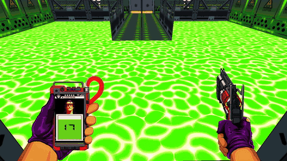<br/><sub><b>튜토리얼</b> — 흐르는 산성 바닥 위 다리 구간</sub></td>
    <td width="50%">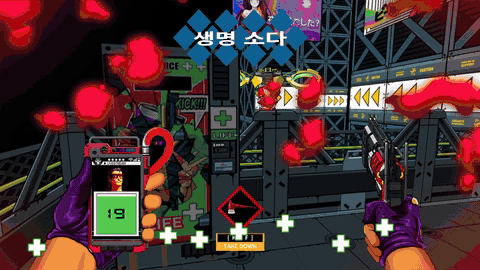<br/><sub><b>일반 맵</b> — 측면 대시 벽을 따라 이동</sub></td>
  </tr>
  <tr>
    <td>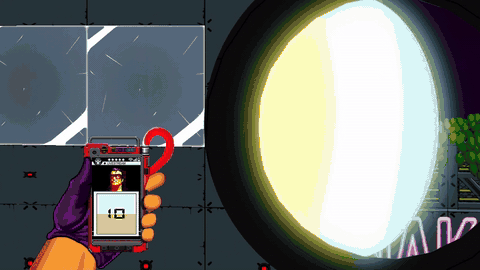<br/><sub><b>스나이퍼 맵</b> — 빌딩 외벽 창문 너머 저격</sub></td>
    <td>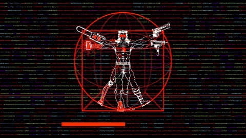<br/><sub><b>자동차 맵</b> — 고속도로 추격</sub></td>
  </tr>
</table>

---

## 내 담당

**맵 에디터**
- ImGui 맵 에디터 개발 — 씬 · 인스펙터 · 툴바 · 계층 창 · 메뉴 · 카메라
- 오브젝트 배치 · 선택 · 복제 · 속성 편집, 에디터 오브젝트 16종

**파일 입출력**
- 맵을 JSON으로 저장 · 로드 — 에디터 `CFileIO` ↔ 게임 `CMapLoader`
- 방 번호 · 버전 필드를 포함한 맵 포맷 설계

**맵 스트리밍**
- 현재 방 ±1만 올리고, 벗어난 방은 오브젝트 풀에 반납
- 풀 크기를 맵 데이터로 산정

**지형 · 맵 오브젝트**
- 지형 상속 구조(`CTerrain`) 재설계 — 바닥 · 천장 · 벽 · 경사로 · 흐르는 지형
- 문 · 선풍기 벽 · 자판기 · 스테이지 종료 트리거 · 진열 큐브

**레벨 디자인**
- 에디터로 맵 5종 직접 제작 — 튜토리얼 · 일반 · 스나이퍼 · 보스 · 자동차
- 자동차 맵은 끝없는 도로에 맞춰 같은 길이의 방 6개로 설계

> 플레이어 · 무기 · 몬스터 · 보스 · UI · 이펙트는 팀원 작업입니다.

---

## 설계 및 구조

### 맵 제작 파이프라인

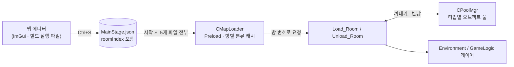

**에디터 ↔ 클라이언트**
- 같은 엔진 위의 별도 프로젝트
- 둘 사이의 계약은 JSON 파일 하나

**로드 시점**
- 시작할 때 맵 5개를 모두 읽어 `파일 → 방 번호 → 오브젝트 목록`으로 캐시
- 플레이 중에는 파일을 다시 읽지 않음

**방 전환**
- 필요한 방만 풀에서 꺼내 배치
- 멀어진 방은 풀에 반납

### 지형 클래스

```
CGameObject
└── CTerrain         Transform · 버퍼 · 텍스처 · 콜라이더 태그 공통
    ├── CFloor       ── CDynamicFloor (흐르는 바닥) · CSlopeFloor (경사로)
    ├── CCeiling     ── CDynamicCeiling
    └── CWall        ── CDynamicWall (선풍기)
```

---

## 주요 구현

### 1. 맵 에디터

맵 5종 · 오브젝트 12,391개를 코드에 좌표를 적어 배치할 수는 없어서, **화면을 보며 배치하고 바로 JSON으로 저장하는 전용 툴**을 만들었습니다.

<table>
  <tr>
    <td width="50%">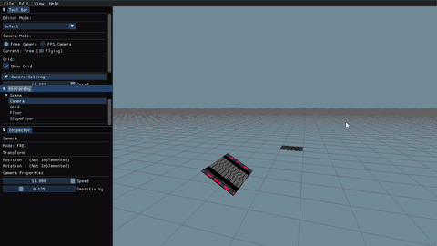<br/><sub><b>선택 · 복제</b> — Ctrl+D로 옆에 이어 붙이기</sub></td>
    <td width="50%">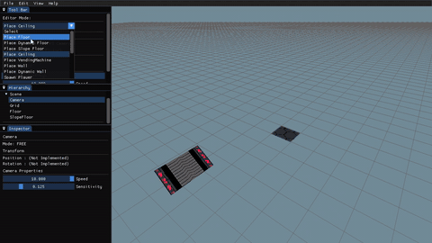<br/><sub><b>인스펙터</b> — 텍스처 목록에서 바로 교체</sub></td>
  </tr>
  <tr>
    <td>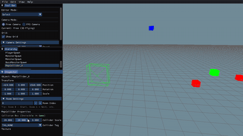<br/><sub><b>맵 콜라이더</b> — 선택 후 크기 조절</sub></td>
    <td>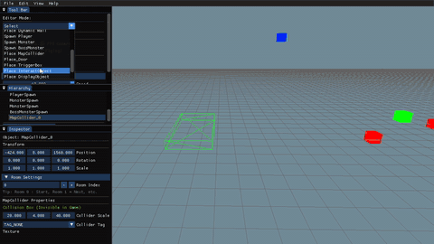<br/><sub><b>문</b> — 배치 후 타입 변경</sub></td>
  </tr>
  <tr>
    <td>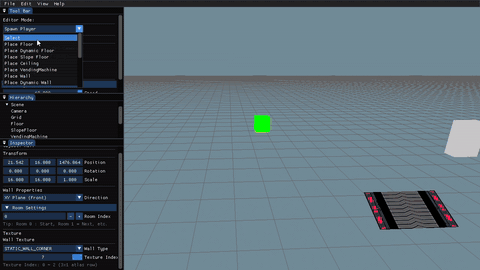<br/><sub><b>플레이어 스폰</b> — 초록 큐브, 맵에 하나만</sub></td>
    <td>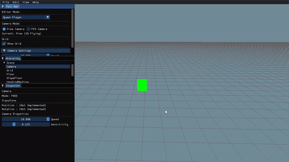<br/><sub><b>몬스터 스폰</b> — 빨간 큐브, 몬스터 종류 지정</sub></td>
  </tr>
</table>

#### 구조

```
CEditorScene          입력 처리 · 오브젝트 목록 소유
├── CSelectionMgr     클릭 선택 · 다중 선택
└── CFileIO           JSON 저장 · 로드

ImGui 패널
├── CToolBar          편집 모드(선택 + 배치 17종) · 카메라 모드 · 그리드
├── CInspector        선택한 오브젝트의 타입별 속성
├── CHierarchy        씬 오브젝트 목록
└── CMainMenuBar      새 맵 · 저장 · 열기

CEditorObject         에디터용 오브젝트 공통 부모 — 바닥 · 벽 · 문 · 스폰 등 16종
```

**게임과 분리된 에디터 전용 오브젝트**
- 편집에 필요한 정보(변환 · 타입 · 텍스처 · 방 번호)만 가짐
- 저장할 때 `CFileIO`가 타입별로 필요한 필드만 JSON에 기록

**ImGui 패널 분리**
- 모드 선택 · 속성 편집 · 목록 · 파일 메뉴를 패널별 클래스로 나눔

#### 맵 제작 편의 기능

배치할 양이 많은 만큼 **반복 작업을 줄이는 기능**에 집중했습니다.

**빠른 배치**
- 방향 복제 — `방향키`로 방향 선택 후 `Ctrl+D`
  - 오브젝트 크기만큼 옆에 붙어 복도 · 바닥을 연타로 확장
  - 경사로는 반대쪽 끝에 이어 붙어 계단도 연속 제작
- 다중 선택 — `Ctrl` + 클릭으로 여러 개를 골라 한 번에 복제 · 삭제

**정확한 선택**
- 겹친 오브젝트는 스폰 > 자판기 > 벽 > 바닥 순으로 선택 — 바닥 위 작은 오브젝트를 먼저 집음
- ImGui 패널 위 클릭은 씬에 전달하지 않아 잘못 배치되지 않음

**코드 수정 없는 편집**
- 인스펙터에서 텍스처 · 타입 · 콜라이더 태그 · 문 ID · 경사 각도 · 몬스터 종류 변경
- `Room Index`로 스트리밍 단위를 에디터에서 지정

**실수 방지**
- 플레이어 스폰은 맵에 1개만 — 이미 있으면 교체할지 확인

**맵 확인 · 파일**
- `1` 자유 카메라 / `2` FPS 카메라 — FPS는 수평으로만 이동해 높이를 유지한 채 동선 확인
- 우클릭 + `WASD` · `QE`로 이동, `Shift` 2배속
- `Ctrl+N` / `S` / `O` 새 맵 · 저장 · 열기, `Delete` 선택 삭제

#### 핵심 로직 — 로컬 공간 레이 피킹

- 오브젝트마다 크기 · 회전이 달라도 **레이를 오브젝트의 로컬 공간으로 옮기면** 단위 상자(-1 ~ 1) 하나로 판정 가능
- 판정은 축별 구간을 겹쳐 보는 Slab 방식

```cpp
// CSelectionMgr::Pick_Object (요약)
D3DXMatrixInverse(&matWorldInv, nullptr, pObj->Get_WorldMatrix());
D3DXVec3TransformCoord (&vLocalRayPos, &vRayPos, &matWorldInv);   // 점: 이동까지 적용
D3DXVec3TransformNormal(&vLocalRayDir, &vRayDir, &matWorldInv);   // 방향: 회전 · 크기만
if (Intersect_RayAABB(vLocalRayPos, vLocalRayDir, _vec3(-1,-1,-1), _vec3(1,1,1), &fDist))
    pickedList.push_back({ pObj, fDist, GetPickingPriority(pObj) });
```

### 2. JSON 맵 포맷

에디터와 클라이언트는 별도 프로젝트라 둘 사이를 **JSON 파일 하나**로 연결했습니다.
맵을 고쳐도 클라이언트를 다시 빌드하지 않고 파일만 바꾸면 됩니다.

```json
{ "type": "Floor",     "roomIndex": 1, "position": [-48, 64, 416], "rotation": [90, 0, 0],
  "scale": [8, 8, 1], "floorType": 0, "textureIdx": 5 }
{ "type": "Door",      "roomIndex": 1, "doorID": 2, "doorType": 0, "position": [24, 16, 216], ... }
{ "type": "MapCollider", "roomIndex": 0, "colliderTag": 0, "scale": [32, 16, 48], ... }
```

**구조**
- 공통 필드(타입 · 방 번호 · 변환) + 타입별 필드

**버전 관리**
- 파일마다 `version` 필드
- 클라이언트는 **방 번호가 추가된 버전 4 미만이면 로드 거부**

**텍스트 포맷의 장점**
- 사람이 읽고 비교 가능
- 맵 수정 내역을 Git diff로 확인

### 3. 방 단위 스트리밍

튜토리얼 · 일반 맵은 방 5 ~ 7개, 오브젝트 1,500 ~ 3,200개입니다.
플레이어 주변만 있으면 되므로 **현재 방 ±1개만** 올려 두고, 범위를 벗어난 방은 풀에 반납합니다.

<table>
  <tr>
    <td width="50%">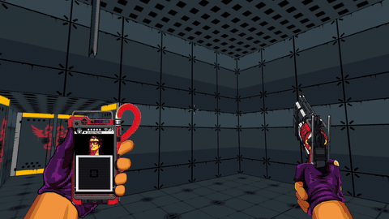<br/><sub><b>로드</b> — 문을 지나면 다음 방(노란 복도)과 몬스터가 이미 준비돼 있어 끊김 없이 이어짐</sub></td>
    <td width="50%">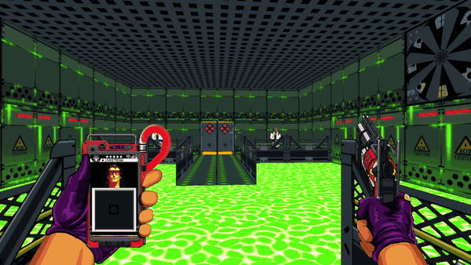<br/><sub><b>해제</b> — 산성 방 → 노란 복도 → 초록 방으로 넘어가는 동안 ±1 범위를 벗어난 방은 해제</sub></td>
  </tr>
</table>

```cpp
// Change_Room (요약) — 방 이동 이벤트에서 호출
for (_int iLoaded : m_setLoadedRooms)                       // 범위 밖 방은 해제
    if (iLoaded < iNewRoom - 1 || iLoaded > iNewRoom + 1)
        roomsToUnload.insert(iLoaded);

for (_int i = iNewRoom - 1; i <= iNewRoom + 1; ++i)          // 범위 안인데 없는 방은 로드
    if (i >= 0 && !m_setLoadedRooms.count(i))
        roomsToLoad.insert(i);
```

**로드**
- 캐시된 방 데이터를 돌며 타입별 풀에서 오브젝트를 꺼냄
- 위치 · 텍스처 · 타입을 설정하고 레이어에 추가

**해제**
- 해당 방 번호의 오브젝트를 `SetDead` 처리하면 레이어가 제거하면서 풀에 반납
- 플레이어 · 카메라는 제외

**스테이지 전환**
- 로드된 방을 모두 해제
- 다음 맵 파일의 0 · 1번 방을 로드

### 4. 풀 크기를 맵 데이터로 산정

방을 오갈 때마다 생성 · 삭제하지 않도록 오브젝트를 풀에서 꺼내 씁니다.
풀이 모자라면 오브젝트가 안 나오고 너무 크면 메모리가 낭비되므로, **맵 데이터로 필요한 최대치를 계산**해 풀 크기를 정했습니다.

**방법**
- 동시에 올라가는 방이 **연속 3개**
- 모든 맵 파일에서 **연속한 방 3개의 합 중 최댓값**을 타입별 풀 크기로 사용

```cpp
// CMapLoader::Get_MaxObjectCount (요약)
for (auto iter = roomMap.begin(); iter != roomMap.end(); ++iter)   // 시작 방을 하나씩 밀며
{
    _uint iSum = 0;
    for (_int i = 0; i < 3; ++i)                                    // 연속 3개 방의 합
        if (auto t = roomMap.find(iter->first + i); t != roomMap.end())
            iSum += t->second.Count(objectType);
    iMaxCount = max(iMaxCount, iSum);
}
// CMainApp: 맵 5개 파일에 대해 다시 max → 타입별 풀 생성
```

### 5. 지형과 맵 오브젝트

<table>
  <tr>
    <td width="50%">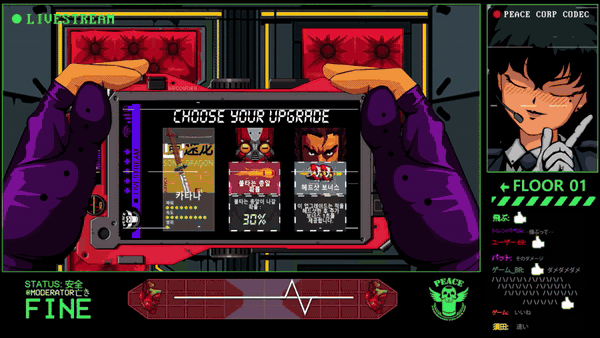<br/><sub><b>문</b> — 다음 맵 시작 시 좌우 문짝이 경첩을 축으로 열림</sub></td>
    <td width="50%">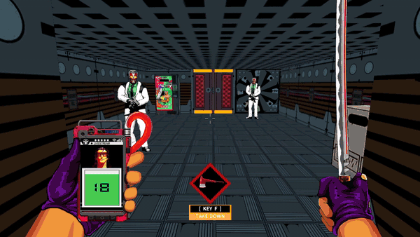<br/><sub><b>자판기</b> — 발차기로 소다를 꺼내는 상호작용</sub></td>
  </tr>
</table>

**지형 상속 구조**
- 바닥 · 천장 · 벽이 같은 멤버(Transform · 버퍼 · 텍스처 · 콜라이더 태그)를 각자 들고 있어, 지형을 늘릴 때마다 같은 코드가 반복됨
- 공통 멤버를 `CTerrain` 하나로 통합하고, 정적 / 움직이는 변형은 자식 클래스로 분리

**문**
- `CDoor`가 좌우 문짝(`CDoorLeft` / `CDoorRight`)을 소유
- 문짝이 경첩을 축으로 돌도록 **한쪽 끝이 원점인 사각형 버퍼** `CRcTexSide`(정점 x = 0 ~ 2)를 엔진에 추가
- 목표 각도(-80°)까지 일정 속도로 회전, 열리면 콜라이더 비활성화

**경사로**
- 경사 각도(0 ~ 89°)와 방향(±X · ±Z)으로 회전 계산 (`90° - 경사각`)

**자판기 · 스테이지 종료 트리거 · 진열 큐브**
- 배치 · 저장 · 로드 경로까지 포함해 구현

**맵 콜라이더 · 트리거 박스**
- 벽 태그(측면 대시 X / Z, 선풍기, 전기 등)를 에디터에서 지정
- 방 이동 트리거를 배치해 게임 로직과 연결

**정적 지형 최적화**
- 움직이지 않는 지형의 Transform을 매 프레임 갱신 목록에서 **정적 목록**으로 이동
- 로드할 때 한 번만 월드 행렬 계산 — 오브젝트 4,739개인 스나이퍼 맵에서도 지형 갱신 비용 없음

```cpp
m_mapComponent[ID_STATIC].insert({ L"Com_Transform", pComponent });          // ID_DYNAMIC → ID_STATIC
pFloor->Get_Component(ID_STATIC, L"Com_Transform")->Update_Component(0.f);   // 로드 시 1회
```

### 6. 무한 도로 맵

보스전 후반의 고속도로 추격 스테이지는 끝없이 달려야 하지만 도로를 무한히 길게 배치할 수는 없습니다.
그래서 **같은 길이의 방 6개를 계속 앞으로 옮겨 붙여** 끝없이 이어지는 도로로 만들었습니다.

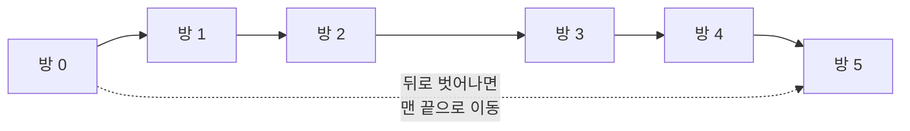

**맵 데이터 설계**
- 방 6개를 모두 **길이 320으로 통일** — 방마다 도로 바닥 45장
- 방 경계에서 도로 · 가드레일 · 빌딩이 끊기지 않도록 배치
- 방마다 **판정용 맵 콜라이더**, 0번 방 뒤쪽에 **끝 지점 콜라이더** 배치
- 방 길이 · 콜라이더 위치를 런타임 상수(방 반길이 160)에 맞춰야 이어 붙였을 때 틈이 없음

```
방 번호   바닥 Z 범위      판정 콜라이더 Z
0        0 ~ 256          128   (+ 끝 지점 콜라이더 -80)
1        320 ~ 576        448
2        640 ~ 896        768
...      (320 간격 반복)
5        1600 ~ 1856      1728
```

**런타임 재배치 (팀 공용 로직 활용)**
- 팀에서 구현한 방 재배치 로직 위에서 동작하도록 맵 데이터를 맞춤
- 방 순서를 큐로 관리
- 맨 앞 방의 콜라이더가 끝 지점 콜라이더와 겹치면 그 방을 **마지막 방 바로 뒤**로 이동

```cpp
// CRoadStage (요약)
if (CCollision::CheckCollision(frontRoomCollider, endCollider))
{
    _int iLast = m_qRoomOrder.back();
    m_pRoom[iFront]->Set_Pos_Room(lastZ + lastHalfZ * 2.f);   // 마지막 방 뒤에 붙임
    m_qRoomOrder.pop();
    m_qRoomOrder.push(iFront);
}
```

**재활용 방식의 장점**
- 고정된 방 6개를 계속 재사용하므로 오브젝트를 새로 만들지 않아 추가 로드 비용이 없음

### 7. UV 스크롤 바닥 · 천장 · 벽

물 · 용암 · 산성 표면은 흐르는 것처럼 보여야 하고, 밟았을 때의 판정도 보이는 타입과 맞아야 합니다.
텍스처 좌표(UV)를 시간에 따라 밀어 **흐르는 표면**을 표현하고, 타입을 바꾸면 판정 태그도 함께 바뀌게 했습니다.

<p align="center">
  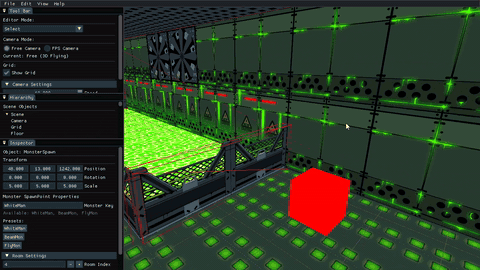
  <br/><sub>에디터에서도 흐르는 모습 그대로 보이는 산성 바닥</sub>
</p>

**UV 스크롤 컴포넌트 활용**
- 팀 프레임워크의 `CScrollTexture` — 매 프레임 `UV += 방향 × 속도 × dt`

**지형 클래스**
- `CDynamicFloor` · `CDynamicCeiling` · `CDynamicWall`
- 타입(물 · 용암 · 산성)을 바꾸면 **텍스처와 콜라이더 태그를 함께 교체** — 보이는 모습과 판정이 동시에 바뀜
- 텍스처가 반복되도록 **UV Wrap 렌더 그룹**(`RENDER_NONALPHA_WRAP`)으로 그림

**에디터 적용**
- 에디터에도 같은 컴포넌트를 적용해 **배치하는 순간부터 흐르는 모습** 확인

```cpp
// CDynamicFloor (요약)
_int CDynamicFloor::Update_GameObject(const _float& fTimeDelta)
{
    m_pScrollTextureCom->Update_Texture(fTimeDelta);                        // UV 이동
    CRenderer::GetInstance()->Add_RenderGroup(RENDER_NONALPHA_WRAP, this);  // 반복 샘플링
    ...
}

void CDynamicFloor::Set_FloorType(_uint eFloorType)
{
    m_pScrollTextureCom->Change_Texture(eFloorType);       // WATER / LAVA / ACID _Scroll.dds
    switch (eFloorType)
    {
    case DYNAMIC_FLOOR_WATER: Set_ColliderTag(TAG_WATER); break;   // 판정도 함께 교체
    ...
    }
}
```

---

## 구현 콘텐츠

맵 5종을 에디터로 직접 배치했습니다.
맵마다 **왼쪽은 에디터에서 설계한 화면, 오른쪽은 같은 장소의 실제 플레이**입니다.

| 맵 | 방 | 배치 오브젝트 | 핵심 요소 |
| --- | ---: | ---: | --- |
| [튜토리얼 (Floor 1)](#튜토리얼-floor-1) | 5 | 1,508 | 흐르는 산성 바닥 · 선풍기 벽 · 문 |
| [일반 맵 (Floor 2)](#일반-맵-floor-2) | 7 | 3,221 | 경사로 계단 · 측면 대시 벽 · 아레나 · 자판기 |
| [스나이퍼 맵](#스나이퍼-맵) | 1 | 4,739 | 빌딩 외벽 · 창문 · 원거리 스폰 |
| [보스 맵](#보스-맵) | 1 | 2,328 | 옥상 아레나 · 스카이박스 |
| [자동차 맵](#자동차-맵) | 6 | 595 | 방 단위로 이어지는 고속도로 |

<br/>

### 튜토리얼 (Floor 1)

조작 · 상호작용 · 전투를 익히는 첫 스테이지입니다.

**세부 구현 사항**
- **회복**
  - 교전 동선에 자판기 배치
  - 소다로 체력 회복
- **선풍기 벽**
  - 선풍기 태그 콜라이더 배치
  - 적이 닿으면 폭발 처치
- **산성 바닥**
  - 흐르는 산성 바닥 104장
  - 밟으면 지속 데미지 — 다리 위로 이동

<table>
  <tr>
    <td width="50%"><br/><sub><b>에디터</b> — 산성 바닥 위 다리와 양쪽 몬스터 스폰</sub></td>
    <td width="50%"><br/><sub><b>플레이</b> — 같은 다리를 건너며 교전</sub></td>
  </tr>
  <tr>
    <td>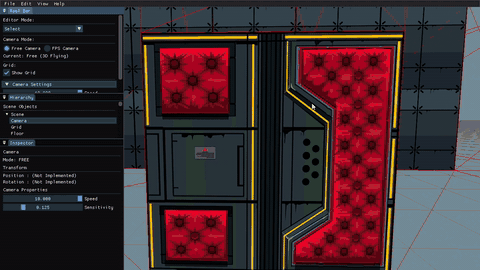<br/><sub><b>에디터</b> — 선풍기 벽과 몬스터 스폰 배치</sub></td>
    <td>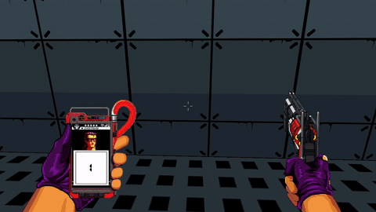<br/><sub><b>플레이</b> — 선풍기 벽 앞 교전</sub></td>
  </tr>
</table>

<br/>

### 일반 맵 (Floor 2)

본격적인 전투 스테이지입니다.

**세부 구현 사항**
- **경사로 전투**
  - 긴 내리막을 미끄러져 내려오며 교전
  - 경사로를 이어 붙인 계단 방
- **측면 대시 벽**
  - 화살표 벽에 측면 대시 태그 콜라이더
  - 벽을 따라 이동하는 동선
- **아레나**
  - 선풍기 벽으로 둘러싼 교전 공간
  - 교전 후 출구 문 개방

<table>
  <tr>
    <td width="50%">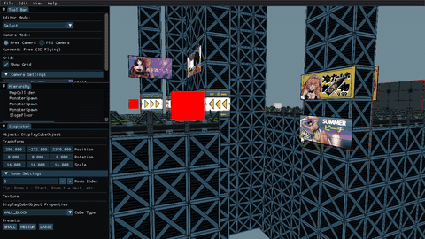<br/><sub><b>에디터</b> — 철골 비계에 화살표 벽과 간판 배치</sub></td>
    <td width="50%"><br/><sub><b>플레이</b> — 화살표 벽을 따라 측면 대시</sub></td>
  </tr>
  <tr>
    <td>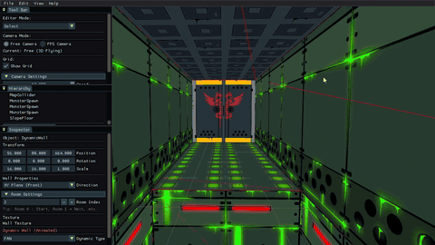<br/><sub><b>에디터</b> — 선풍기 벽으로 둘러싼 초록 아레나와 스폰</sub></td>
    <td>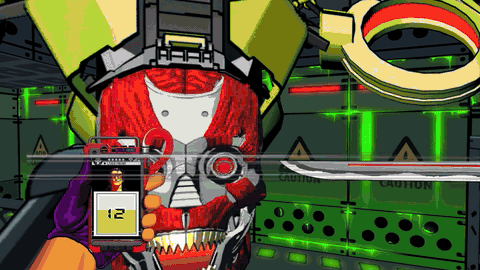<br/><sub><b>플레이</b> — 아레나 교전 후 출구 문</sub></td>
  </tr>
</table>

<table>
  <tr>
    <td width="50%">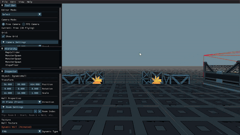<br/><sub><b>에디터</b> — 야자수 · 간판 사이로 길게 내려가는 경사로</sub></td>
    <td width="50%">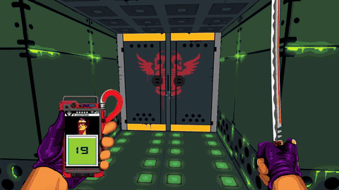<br/><sub><b>플레이</b> — 경사로를 미끄러져 내려가며 아래쪽 적 처치</sub></td>
  </tr>
  <tr>
    <td>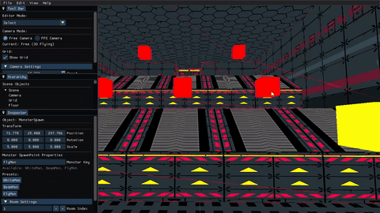<br/><sub><b>에디터</b> — 경사로를 이어 붙인 계단 방</sub></td>
    <td>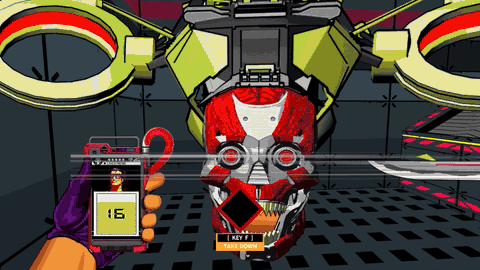<br/><sub><b>플레이</b> — 계단 위아래의 적과 교전</sub></td>
  </tr>
</table>

<br/>

### 스나이퍼 맵

저격총으로 원거리 교전을 하는 스테이지입니다.

**세부 구현 사항**
- **빌딩 외벽**
  - 바닥 3,455 · 벽 1,147로 건물 외관 구성
- **창문 저격**
  - 창문 120개 배치
  - 창문 너머에 적 스폰

<table>
  <tr>
    <td width="50%">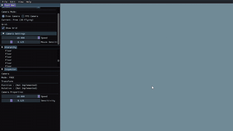<br/><sub><b>에디터</b> — 창문이 줄지어 박힌 빌딩 외벽과 스폰</sub></td>
    <td width="50%"><br/><sub><b>플레이</b> — 스코프로 창문 너머 저격</sub></td>
  </tr>
</table>

<br/>

### 보스 맵

보스전을 위한 옥상 아레나입니다.

**세부 구현 사항**
- **전투 공간**
  - 바닥 1,996장으로 넓은 아레나
- **배경**
  - 스피커 · 간판 · 화분으로 가장자리 장식
  - 스카이박스

<table>
  <tr>
    <td width="50%">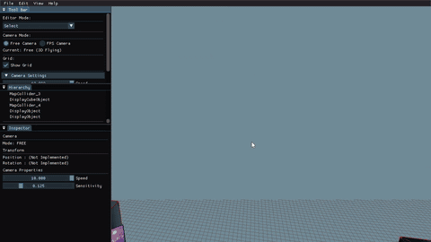<br/><sub><b>에디터</b> — 옥상 아레나 · 바닥 패턴 · 간판</sub></td>
    <td width="50%">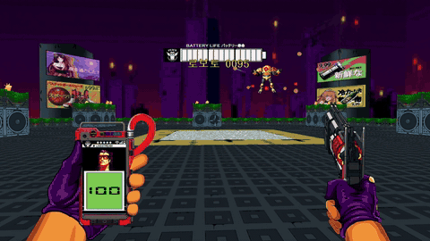<br/><sub><b>플레이</b> — 같은 아레나에서 보스전</sub></td>
  </tr>
</table>

<br/>

### 자동차 맵

보스전 후반, 고속도로 위에서 추격전을 벌이는 스테이지입니다.

**세부 구현 사항**
- **무한 도로**
  - 같은 길이의 도로 방 6개를 이어 붙임
  - 자세한 구조는 [주요 구현 6](#6-무한-도로-맵) 참고
- **도시 배경**
  - 진열 오브젝트 271개 — 빌딩 · 표지판 · 간판

<table>
  <tr>
    <td width="50%">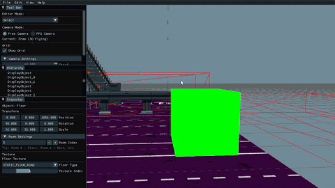<br/><sub><b>에디터</b> — 도로 위 표지판 · 육교와 스폰 배치</sub></td>
    <td width="50%"><br/><sub><b>플레이</b> — 고속도로 추격전</sub></td>
  </tr>
</table>

---

## 기술 스택

**언어 · 그래픽스**

| 기술 | 활용 |
| --- | --- |
| C++ | 추상 클래스와 가상 함수로 지형 · 에디터 오브젝트 계층을 구성하고 타입별 오브젝트 풀과 연결 |
| DirectX 9 | 고정 파이프라인에서 렌더 상태를 저장 · 복원하며 벽 · 문에 양면 렌더링 적용, 문 경첩용 사각형 정점 버퍼 추가 |

**툴 · 라이브러리**

| 기술 | 활용 |
| --- | --- |
| ImGui | 툴바 · 인스펙터 · 계층 · 메뉴 패널로 맵 에디터를 구성하고 단축키로 저장 · 열기 처리 |
| nlohmann/json | 맵 오브젝트를 공통 필드와 타입별 필드로 직렬화하고, 버전 필드로 포맷 호환 여부 검사 |
| Win32 API | 파일 대화상자로 맵 파일을 선택하고, 파일명 · 오브젝트 이름을 UTF-8로 변환해 저장 |

**자료구조**

| 기술 | 활용 |
| --- | --- |
| 중첩 맵 캐시 | 맵 데이터를 파일명 · 방 인덱스 이중 맵으로 선파싱해 방 로딩 시 조회만 수행 |
| set | 로드된 방 번호를 보관하고 현재 방 ±1과 비교해 로드 · 해제 대상 계산 |
| 객체 풀 | 타입별 풀에서 지형 · 몬스터를 꺼내 배치하고 방 해제 시 반납 |

**알고리즘 · 수학**

| 기술 | 활용 |
| --- | --- |
| 광선 교차 판정 | 화면 좌표를 NDC에서 역투영해 월드 광선을 만들고, 로컬 공간에서 축별 진입 · 이탈 거리로 피킹 |
| 광선-평면 교차 | 바닥 평면(Y = 0)과의 교차점으로 오브젝트 배치 위치 계산 |
| 구간 최댓값 | 연속한 방 3개의 오브젝트 수 합 중 최댓값으로 타입별 풀 크기 산정 |
| 우선순위 정렬 | 피킹 후보를 타입 우선순위 → 거리 순으로 정렬해 겹친 오브젝트 중 하나 선택 |

**설계**

| 기술 | 활용 |
| --- | --- |
| 데이터 주도 파이프라인 | 에디터 → JSON → 클라이언트로 맵 내용과 코드를 분리 |
| 상속 구조 | `CTerrain` · `CEditorObject` 공통 부모에 변환 · 텍스처 · 태그를 모으고 타입별 차이만 자식에서 구현 |
| Singleton | 에디터의 파일 입출력(`CFileIO`)과 클라이언트의 맵 로더(`CMapLoader`)를 단일 인스턴스로 두고 어디서나 저장 · 로드 호출 |

---

> 학습 목적의 팀 모작입니다. 원작 「MULLET MADJACK」(HAMMER95)의 이미지 · 사운드 등 리소스 저작권은 원작사에 있습니다.
